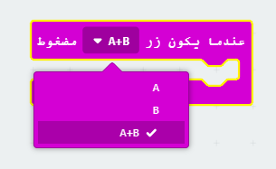
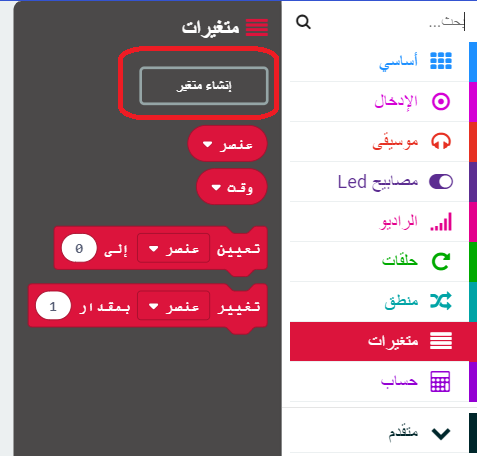

## إعداد المؤقت الخاص بك

لنقم بضبط المؤقت على 0 عند الضغط على الزرين A و B معًا.

+ اذهب إلى <a href="http://rpf.io/microbit-new" target="_blank">rpf.io/microbit-new</a> لبدء مشروع جديد في محرر MakeCode (PXT) قم بتسمية مشروعك باسم "المؤقت".

+ احذف الكتل البرمجية `عند البدء` و `إلى الأبد`، لأنك لا تحتاج إليها.

+ إضافة `جديد على زر الضغط على الحدث` وحدد `A + B` :.
    
    

+ انقر على "المتغيرات" ثم "إنشاء متغير" ، وأنشئ متغيرًا جديدًا يسمى `الوقت `.
    
    

+ عندما يتم الضغط على الزرين A و B معًا ، فأنت تريد `الوقت` يتم ضبطه على `0`. للقيام بذلك ، اسحب مجموعة ` ` الضغط على `على الزر A + B` منع:
    
    

القيمة الافتراضية للصفر هي ما تحتاجه.

+ يجب عليك أيضًا عرض `الوقت`. للقيام بذلك، اسحب في `إظهار الرقم` وسحب متغير `وقت` في:
    
    

+ انقر فوق 'تشغيل' لاختبار الكود الخاص بك. اضغط على زر 'A+B' (أسفل المايكروبيت (micro:bit) لتعيين المؤقت الخاص بك إلى 0.
    
    