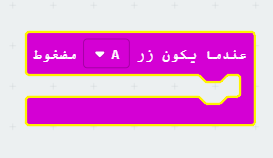
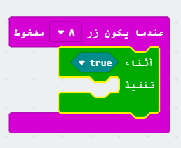
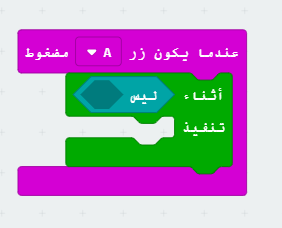
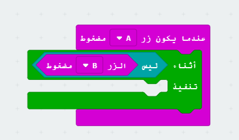
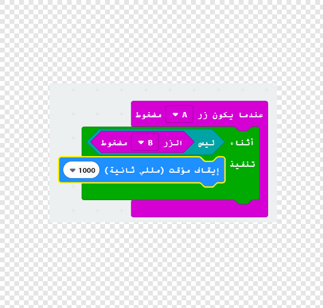
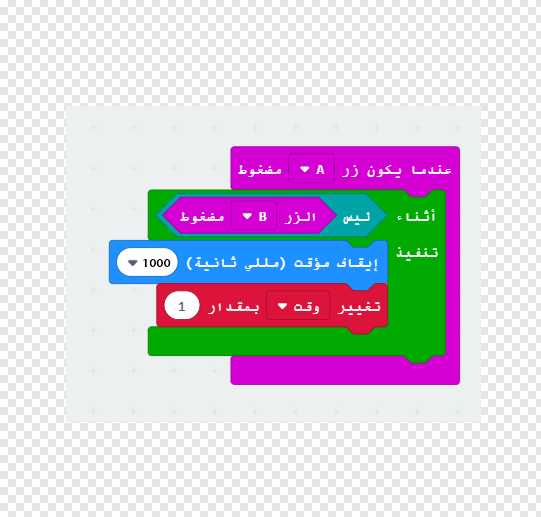
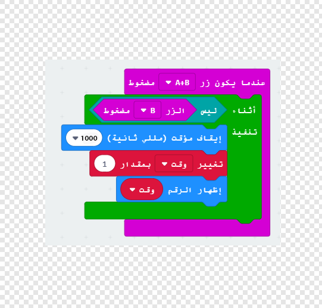

## بدء وإيقاف المؤقت

دعونا نستخدم الزر A لبدء تشغيل المؤقت الخاص بك، والزر B لإيقافه.

+ يجب أن يبدأ المؤقت الخاص بك عند الضغط على الزر A. إضافة حدث جديد `على الزر A مضغوط` إلى التعليمة الخاص بك:
    
    

+ يجب أن يقوم المؤقت بالعد طالما لم يتم الضغط على الزرB. للقيام بذلك، اسحب أولاً كتلة `while` إلى الحدث الجديد `على الزر A مضغوط`.
    
    

+ اسحب كتلة `not` من 'Logic' إلى كتلة `while` الخاصة بك:
    
    

+ يمكنك بعد ذلك سحب كتلة `زر B مضغوط` بعد كتلة `لا`.
    
    
    
    سيتم تشغيل أي رمز داخل حلقة `while` بشكل متكرر،**طالما لم يتم الضغط على الزر B**.

+ بعد ذلك، تريد إضافة 1 إلى متغير `time` كل ثانية (1 ثانية = 1000 م). أضف كتلة `توقف` لجعل المؤقت الخاص بك ينتظر لمدة ثانية واحدة.
    
    

+ لزيادة متغير `الوقت` الخاص بك،
    
    

+ أخيرا، ستحتاج إلى عرض `وقت` متغير المحدث. إليك كيفية ظهور شفرتك:
    
    

+ انقر فوق 'تشغيل' لاختبار الكود الخاص بك.
    
    + اضغط على الزرين A و B معا لتعيين المؤقت إلى 0
    + اضغط على الزر A لبدء المؤقت الخاص بك
    + اضغط على الزرB (مع الاستمرار) لإيقاف المؤقت الخاص بك 
    
    

## تحدي أصدقائك!

استخدم المؤقت لتحدي أصدقائك. على سبيل المثال، يمكنك أن ترى كم من الوقت يستغرقه قول الأبجدية إلى الخلف، أو تسمية 10 عواصم.