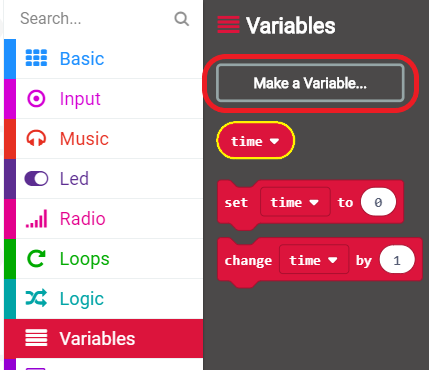

## Gosod eich amserydd

Gadewch i ni osod eich amserydd i 0 pan fydd botymau A a B yn cael eu gwasgu gyda'i gilydd.

+ Ewch i <a href="http://rpf.io/microbit-new" target="_blank">rpf.io/microbit-new</a> i ddechrau prosiect newydd yn y golygydd MakeCode (PXT). Enwch eich prosiect yn 'Amserydd'.

+ Dilëwch y blociau `on start` (ar y cychwyn) a `forever` (am byth), gan nad oes eu hangen arnoch chi.

+ Ychwanegwch ddigwyddiad `on button pressed` (pan wasgir botwm) newydd a dewis `A + B` :.
    
    

+ Cliciwch 'Variables' (Newidynnau) yna 'Make a variable' (Gwneud newidyn), ac chreu newidyn newydd o'r enw `time` (amser).
    
    

+ Pan fydd botymau A a B yn cael eu pwyso gyda'i gilydd, rydych chi am i'r `time` (amser) gael ei osod i `0`. I wneud hyn, llusgwch floc `set` (gosod) i mewn i'ch bloc `on button A+B pressed`:
    
    

Gwerth diofyn sero yw'r hyn sydd ei angen arnoch chi.

+ Dylech hefyd arddangos yr `time` (amser). I wneud hyn, llusgwch bloc `show number` a llusgwch eich newidyn `time` (amser) i mewn iddo:
    
    

+ Cliciwch 'run' (rhedeg) i brofi eich cod. Gwasgwch y botwm 'A + B' (islaw'r micro:bit) i osod eich amserydd i 0.
    
    