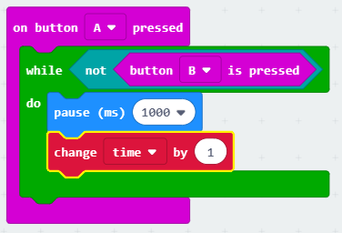
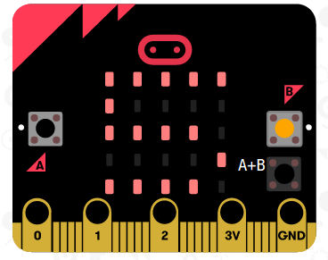

## Dechrau a stopio eich amserydd

Gadewch i ni ddefnyddio botwm A i gychwyn eich amserydd, a botwm B i'w atal.

+ Dylai eich amserydd ddechrau pan fo botwm A yn cael ei wasgu. Ychwanegwch floc newydd `on button A pressed` (botwm A wedi'i bwyso) i'ch sgript:
    
    

+ Dylai'r amserydd gyfrif i fyny cyhyd â bod botwm B **heb ei wasgu**. I wneud hyn, yn gyntaf llusgwch floc `while` (tra) i mewn i'ch digwyddiad `on button A pressed` (pan wasgir botwm A) newydd.
    
    

+ Llusgwch floc `not` (nid), o 'Logic' i'ch bloc `while` (tra):
    
    

+ Yna gallwch lusgo bloc `button B pressed` (gwasgwyd botwm B) ar ôl y bloc `not` (nid).
    
    
    
    Bydd unrhyw god y tu mewn i'r ddolen `while` (tra) yn cael ei redeg dro ar ôl tro, **cyhyd â bod botwm B heb ei wasgu**.

+ Nesaf, rydych am ychwanegu 1 at eich newidyn `time` (amser) bob eiliad (1 eiliad = 1000 ms). Ychwanegwch floc `pause` (oedi) i wneud i'ch amserydd aros am 1 eiliad.
    
    

+ I gynyddu eich newidyn `time` (amser),
    
    

+ Yn olaf, bydd angen i chi arddangos y newidyn `time` (amser) wedi'i ddiweddaru. Dyma sut y dylai eich cod ymddangos:
    
    

+ Cliciwch 'run' (rhedeg) i brofi eich cod.
    
    + Gwasgwch fotymau A a B gyda'i gilydd i osod eich amserydd i 0
    + Gwasgwch fotwm A i gychwyn eich amserydd
    + Gwasgwch (a daliwch) fotwm B i atal eich amserydd
    
    

## Heriwch eich ffrindiau!

Defnyddiwch yr amserydd i herio'ch ffrindiau. Er enghraifft, gallech weld pa mor hir y mae'n cymryd iddynt ddweud yr wyddor am yn ôl, neu enwi 10 prifddinas.