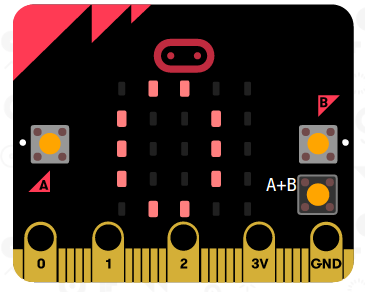

## Timer einstellen

Lass uns deinen Timer auf 0 setzen, wenn die Knöpfe A und B gleichzeitig gedrückt werden.

+ Gehe zu <a href="http://rpf.io/microbit-new" target="_blank">rpf.io/microbit-new</a> und beginne ein neues Project im "MakeCode (PXT)"-Editor. Nenne dein Projekt "Timer".

+ Lösche die `beim Start` und `wiederhole fortlaufend ` Blöcke, da du sie nicht brauchst.

+ Füge eine neue `wenn Knopf gedrückt` Eingabe hinzu und wähle `A+B` aus:.
    
    

+ Klicke auf 'Variablen' und 'Erstelle eine Variable...', und nenne deine neue Variable `Zeit`.
    
    

+ Wenn die Knöpfe A und B gleichzeitig gedrückt werden, soll die `Zeit` auf `0` gestellt werden. Ziehe dafür einen `setze Zeit auf` Block in deinen `wenn Knopf gedrückt` Block:
    
    

Der Standardwert "Null" ist der Wert, den du haben musst.

+ Du solltest auch die `Zeit` anzeigen. Erstelle dafür einen `zeige Zahl` Block, und ziehe deine `Zeit` Variable hinein:
    
    

+ Klicke auf "Simulator starten", um deinen Code zu testen. Drücke den 'A+B' Knopf (unter dem micro:bit) um deinen Timer auf 0 zu setzen.
    
    