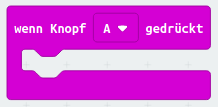
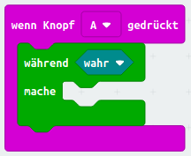
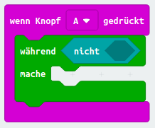
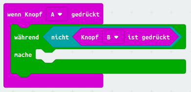
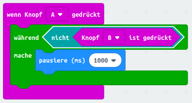
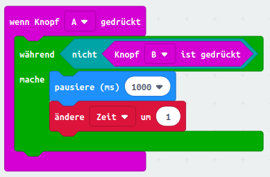
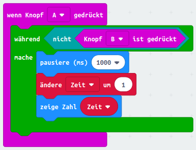

## Timer starten und anhalten

Starte den Timer mit Knopf A, und halte ihn mit Knopf B an.

+ Dein Timer sollte starten, wenn Knopf A gedrückt wird. Füge einen neuen `wenn Knopf A gedrückt` Block zu deinem Programm hinzu:
    
    

+ Der Timer sollte hochzählen, solange Knopf B **nicht gedrückt wird**. Ziehe dafür zuerst einen `während` Block in deine neue `wenn Knopf A gedrückt` Eingabe.
    
    

+ Ziehe einen `nicht` Block aus "Logik" in deinen `während` Block:
    
    

+ Dann kannst du einen `wenn Knopf B gedrückt` Block hinter den `nicht` Block ziehen.
    
    
    
    Jeder Code in dieser `während` Schleife wird wiederholt ausgeführt, **so lange Knopf B nicht gedrückt wird**.

+ Als nächstes wollen wir pro Sekunde 1 zu deiner `Zeit` Variable hinzuzählen (1 Sekunde = 1000 ms). Füge einen `pausiere (ms)` Block hinzu, um deinen Timer eine Sekunde lang warten zu lassen.
    
    

+ Um deine `Zeit` Variable hochzuzählen,
    
    

+ Schließlich musst du die aktualisierte `Zeit` Variable anzeigen. So sollte dein Code aussehen:
    
    

+ Klicke auf "Simulator starten", um deinen Code zu testen.
    
    + Drücke die Knöpfe A und B gleichzeitig, um deinen Timer auf 0 zu setzen
    + Drücke Knopf A, um deinen Timer zu starten
    + Halte Knopf B gedrückt, um deinen Timer anzuhalten
    
    

## Fordere deine Freunde heraus!

Benutze den Timer, um deine Freunde herauszufordern. Du kannst zum Beispiel sehen, wie lange sie brauchen, um das Alphabet rückwärts aufzusagen, oder 10 Hauptstädte zu benennen.