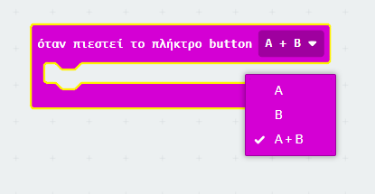
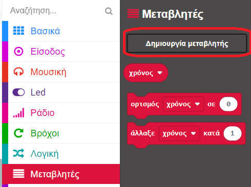
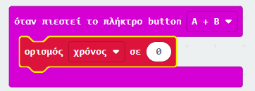
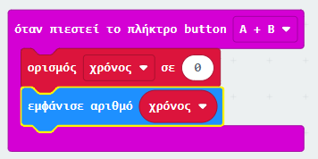

## Ρύθμισε τον χρονόμετρό σου

Ας ρυθμίσουμε το χρονόμετρό σου στο 0 όταν τα κουμπιά A και B πατηθούν μαζί.

+ Πήγαινε στο <a href="http://rpf.io/microbit-new" target="_blank">rpf.io/microbit-new</a> για να ξεκινήσεις ένα νέο έργο στον επεξεργαστή MakeCode (PXT). Ονόμασε το έργο σου 'Χρονόμετρο'.

+ Διάγραψε τα μπλοκ `κατά την έναρξη` και `για πάντα`, καθώς δεν τα χρειάζεσαι.

+ Πρόσθεσε ένα νέο `συμβάν όταν πιεστεί το πλήκτρο` και επίλεξε `A+B`:.
    
    

+ Κάνε κλικ στις 'Μεταβλητές' και μετά στη 'Δημιουργία μεταβλητής', και δημιούργησε μια νέα μεταβλητή που ονομάζεται `χρόνος`.
    
    

+ Όταν τα κουμπιά A και B πιέζονται μαζί, θέλεις ο `χρόνος` να πάρει την τιμή `0`. Για να γίνει αυτό, κάνε κλικ και σύρε ένα μπλοκ `ορισμός σε` μέσα στο μπλοκ `όταν πιεστεί το κουμπί button A+B`:
    
    

Χρειάζεσαι το μηδέν ως προεπιλεγμένη τιμή.

+ Ο `χρόνος` επίσης πρέπει να εμφανιστεί. Για να το κάνεις αυτό, σύρε σε ένα μπλοκ `εμφάνισε αριθμό` και σύρε τη μεταβλητή `χρόνος` μέσα σ' αυτό:
    
    

+ Πάτησε «Run (Έναρξη προσομοιωτή)» για να ελέγξεις τον κώδικά σου. Πατήσε το κουμπί 'A+B' (κάτω από το micro:bit) για να ρυθμίσεις το χρονόμετρο σου στο 0.
    
    