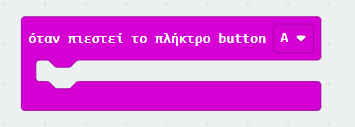
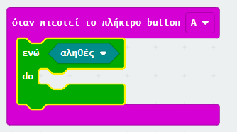
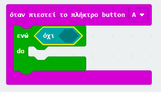
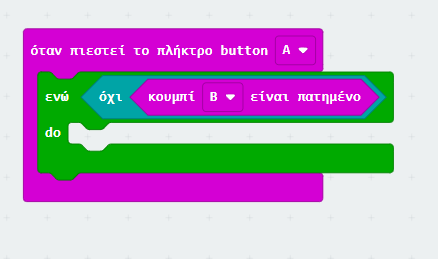
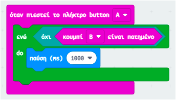
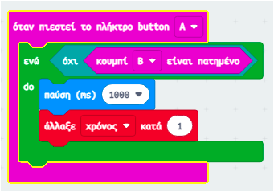
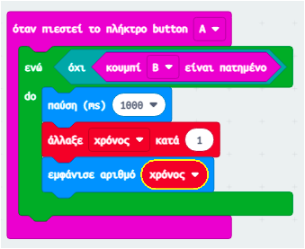

## Ξεκινώντας και σταματώντας το χρονόμετρο

Χρησιμοποίησε το κουμπί A για να ξεκινήσεις το χρονόμετρο και το κουμπί B για να το σταματήσεις.

+ Το χρονόμετρο σου θα πρέπει να ξεκινά όταν πατηθεί το κουμπί Α. Πρόσθεσε ένα νέο μπλοκ `όταν πιεστεί το πλήκτρο button A` στον κώδικά σου:
    
    

+ Το χρονόμετρο θα πρέπει να αυξάνεται όσο **δεν έχει πιεστεί** το κουμπί B. Για να γίνει αυτό, πρώτα σύρε ένα μπλοκ `ενώ` μέσα στο νέο σου συμβάν `όταν πιεστεί το πλήκτρο button A`.
    
    

+ Σύρε ένα μπλοκ `όχι` από τη «Λογική» στο μπλοκ `ενώ`:
    
    

+ Στη συνέχεια μπορείς να σύρεις ένα μπλοκ `κουμπί Β είναι πατημένο` μετά το μπλοκ `όχι`.
    
    
    
    Οποιοσδήποτε κώδικας μέσα σε αυτό το βρόχο `ενώ` θα εκτελείται επανειλημμένα, **όσο το κουμπί Β δεν έχει πατηθεί**.

+ Στη συνέχεια, θέλεις να προσθέτεις 1 στη μεταβλητή `χρόνος` κάθε δευτερόλεπτο (1 δευτερόλεπτο = 1000 ms). Πρόσθεσε ένα μπλοκ `παύση` για να κάνεις το χρονόμετρό σου να περιμένει 1 δευτερόλεπτο.
    
    

+ Για να αυξήσεις τη μεταβλητή `χρόνος`,
    
    

+ Τέλος, θα πρέπει να εμφανίσεις την ενημερωμένη μεταβλητή `χρόνος`. Έτσι πρέπει να φαίνεται ο κώδικας σου:
    
    

+ Πάτησε «Run (Έναρξη προσομοιωτή)» για να ελέγξεις τον κώδικά σου.
    
    + Πίεσε τα κουμπιά A και B μαζί για να ξεκινήσεις το χρονόμετρό σου από το 0
    + Πάτησε το κουμπί Α για να ξεκινήσεις το χρονόμετρο σου
    + Πάτησε (και κράτησε) το κουμπί Β για να σταματήσεις το χρονόμετρο σου
    
    

## • Προκάλεσε τους φίλους σου!

Χρησιμοποίησε το χρονόμετρο για να προκαλέσεις τους φίλους σου. Για παράδειγμα, θα μπορούσες να δεις πόσο χρόνο τους χρειάζεται να πουν το αλφάβητο προς τα πίσω, ή να αναφέρουν 10 πρωτεύουσες.