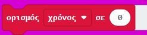
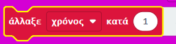
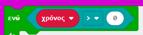

\--- challenge \---

## Πρόκληση: Αντίστροφη μέτρηση

Μπορείς να δημιουργήσεις ένα ** νέο** χρονόμετρο, που να μετράει αντίστροφα έως το 0; Έτσι θα πρέπει να λειτουργεί το νέο σου χρονόμετρο:

+ Πιέζοντας τα κουμπιά A και B μαζί θα πρέπει να επανεκκινείς το `χρονόμετρό` σου από το 0
    
    

+ Πατώντας το πλήκτρο B θα πρέπει να προστίθεται 1 στο χρονόμετρό σου. Πάτα το 10 συνεχόμενες φορές για να δημιουργήσεις ένα χρονόμετρο 10 δευτερολέπτων.
    
    

+ Πατώντας το κουμπί A θα πρέπει να αφαιρείται 1 από τη μεταβλητή `χρόνος` μέχρι να φτάσει στο 0. Αυτό σημαίνει ότι θα χρειαστείς ένα βρόχο `ενώ` που τρέχει όσο ο `χρόνος` είναι μεγαλύτερος από (`>`) 0.
    
    

## Ακριβές χρονόμετρο

Έχεις παρατηρήσει ότι το χρονόμετρο δεν είναι πολύ ακριβές! Αυτό συμβαίνει επειδή χρειάζεται χρόνος για την εμφάνιση και κύλιση αριθμών στο micro:bit.

Δοκίμασε να ρυθμίσεις την παύση για να βελτιώσεις τον συγχρονισμό. Μπορείς να χρησιμοποιήσεις ένα μπλοκ `εάν/αλλιώς` για να έχεις μικρότερες καθυστερήσεις για μεγαλύτερους αριθμούς που χρειάζονται περισσότερο χρόνο για να εμφανιστούν με κύλιση.

\--- /challenge \---