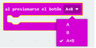
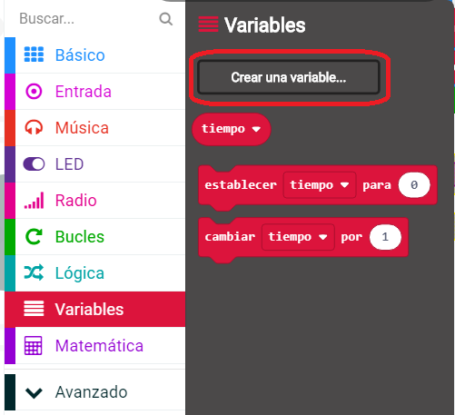
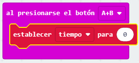
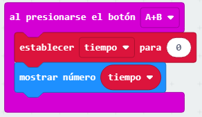
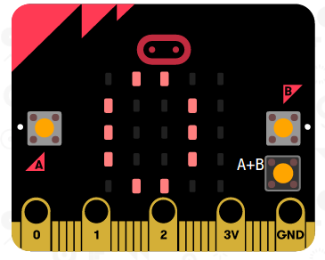

## Configura tu cronómetro

Vamos a configurar tu cronómetro a 0 cuando los botones A y B se presionen al mismo tiempo.

+ Ve a <a href="http://rpf.io/microbit-new" target="_blank">rpf.io/microbit-new</a> para empezar un nuevo proyecto en el editor MakeCode (PXT). Nombra a tu proyecto 'Cronómetro'.

+ Elimina los bloques `al iniciar` y `para siempre`, ya que nos los necesitarás.

+ Agrega `bóton presionado` y selecciona `A+B`:.
    
    

+ Haz clic en 'Variables' y luego 'Crear una variable', y crear una nueva variable llamada `tiempo`.
    
    

+ Cuando los botenes A y B se presionan al mismo tiempo, quieres que el `tiempo` se configure a `0`. Para hacer esto, arrastra un bloque `establecer` en tu bloque `al presionarse el botón A+B `:
    
    

El valor predeterminado de cero es lo que necesitas.

+ También deberías mostrar el `tiempo`. Para hacer esto, arrastre un bloque `mostrar número` y arrastre su variable `tiempo` a este:
    
    

+ Haz click en 'ejecutar' para probar tu proyecto. Pulse el botón 'A+B' (debajo del micro:bit) para ajustar su cronómetro a 0.
    
    