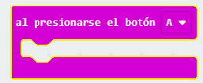
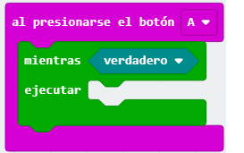
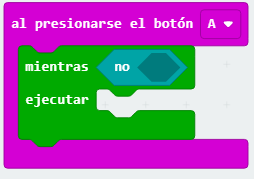
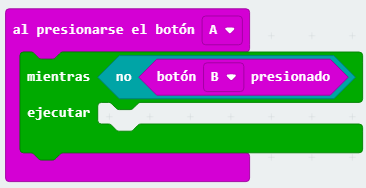
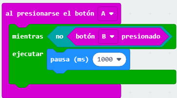
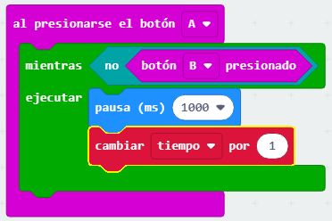
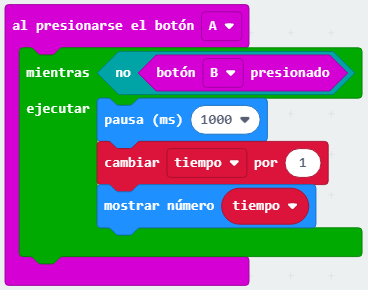

## Iniciar y detener tu cronómetro

Vamos a usar el botón A para iniciar tu cronómetro y el botón B para detenerlo.

+ Tu cronómetro debería iniciar cuando se presione el botón A. Agrega un nuevo bloque `al presionarse el botón A` a tu proyecto:
    
    

+ El cronómetro debería contar mientras que el botón B **no haya sido presionado**. Para hacer esto, primero arrastra un bloque `mientras` a tu nuevo bloque `al presionarse el botón A`.
    
    

+ Arrastra un bloque `no`, de 'Lógica' a tu bloque `mientras`:
    
    

+ Luego puedes arrastrar el bloque `botón B presionado` después del bloque `no`.
    
    
    
    Cualquier código dentro de este bucle `mientras` se ejecutará repetidamente, **siempre y cuando el botón B no haya sido presionado**.

+ A continuación, quieres añadir 1 a tu variable `tiempo` cada segundo (1 segundo = 1000 ms). Añade un bloque `pausa` para hacer que tu cronómetro espere 1 segundo.
    
    

+ Para aumentar tu variable `tiempo`, agregar un bloque <0>cambiar</0>.
    
    

+ Finalmente, necesitarás mostrar la variable `tiempo` actualizada. Así es como debería verse tu código:
    
    

+ Haz click en 'iniciar el simulador' para probar tu código.
    
    + Presione los botones A y B juntos para configurar tu cronómetro a 0
    + Pulsa el botón A para iniciar tu cronómetro
    + Presiona (y mantén presionado) el botón B para detener tu cronómetro
    
    

## ¡Desafía a tus amigos!

Usa el cronómetro para desafiar a tus amigos. Por ejemplo, tu podrías ver cuánto tiempo se tardan en decir el alfabeto al revés, o nombrar 10 capitales.