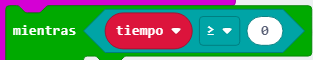

\--- challenge \---

## Desafío: Cuenta regresiva

¿Puedes crear un cronómetro **nuevo**, que cuente hacia atrás hasta 0? Así es como tu nuevo cronómetro debería funcionar:

+ Presionando los botones A y B juntos debería restablecer su `cronómetro` a 0
    
    

+ Pulsando el botón B debería añadir 1 a tu cronómetro. Presiona el botón 10 veces para crear un cronómetro de 10 segundos.
    
    

+ Pulsar el botón A debería tomar 1 de tu variable `tiempo` hasta que llegue a 0. Esto significa que necesitarás un bucle `mientras` que corra siempre y cuando el `tiempo` sea mayor que (`>`) 0.
    
    

## Cronómetro preciso

¡Has notado que el cronómetro no es muy exacto! Esto se debe a que lleva tiempo mostrar y desplazar números en el micro:bit.

Intenta ajustar la pausa para mejorar la precisión de tu cronómetro. Puedes usar un bloque `si/no` para tener retrasos más cortos para números más grandes que tardan más en desplazarse.

\--- /challenge \---