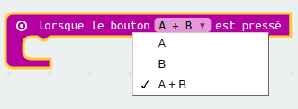
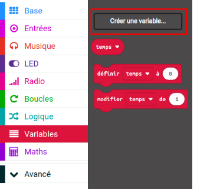
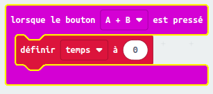
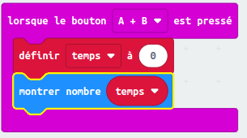

## Configurer ton chronomètre

Réglons ton chronomètre à 0 lorsque les boutons A et B sont appuyés ensemble.

+ Va sur <a href="http://rpf.io/microbit-new" target="_blank">rpf.io/microbit-new</a> pour démarrer un nouveau projet dans l'éditeur MakeCode (PXT). Nomme ton projet « Chronomètre ».

+ Supprime les blocs `au démarrage` et `toujours` car tu n'en as pas besoin.

+ Ajoute un nouvelle entrée `lorsque le bouton est pressé` et sélectionne `A+B`.
    
    

+ Clique sur « Variables » puis « Créer une variable » et choisis de l'appeler `temps`.
    
    

+ Lorsque les boutons A et B sont appuyés ensemble, tu veux que le `temps` soit réglé à `0`. Pour faire cela, glisse un bloc `définir` dans ton bloc `lorsque le bouton A+B est pressé` :
    
    

La valeur par défaut de zéro est ce dont tu as besoin.

+ Tu devais également afficher le `temps`. Pour faire cela, glisse un bloc `montrer le nombre` et fais glisser ta variable `temps` dedans :
    
    

+ Clique « lancer » pour tester ton code. Appuie sur le bouton « A+B » (en dessous du micro:bit) pour régler ton chronomètre à 0.
    
    