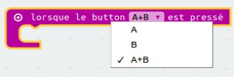

## Configurer ton chronomètre

Remettons ton chronomètre à 0 quand les boutons A et B sont pressés simultannément.

+ Va sur <a href="http://jumpto.cc/pxt-new" target="_blank">jumpto.cc/pxt-new</a>  pour démarrer un nouveau projet dans l'éditeur PXT. Appelle ton projet 'Chrono'.

+ Efface les blocs `au démarrage` et `toujours`, tu n'en auras pas besoin.

+ Ajoute un bloc `lorsque le bouton est pressé` et sélectionne `A+B`&nbsp;:.

	

+ Clique sur 'Variables' puis 'Créer une variable', et crée une nouvelle variable appellée `temps`.

	

+ Quand les boutons A et B sont pressés ensemble, tu veux que `temps` ait la valeur `0`. Pour cela, place un bloc `définir` dans ton bloc `lorsque le bouton A+B est pressé`&nbsp;:

	

La valeur par défaut vaut zéro et c'est ce dont tu as besoin.

+ Tu devrais aussi afficher le `temps`. Pour cela, place un bloc `montrer nombre` et met ta variable `temps` dedans&nbsp;:

	

+ Clique sur 'lancer' pour tester ton code. Appuye sur le bouton 'A+B' (sous la micro:bit) pour mettre ton chronomètre à 0.

	
