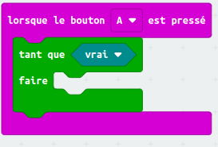
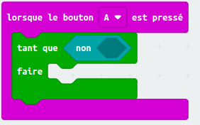
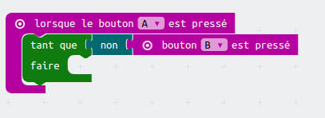
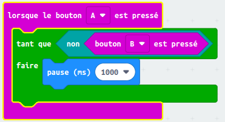
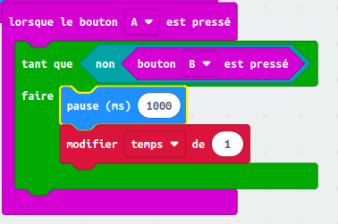
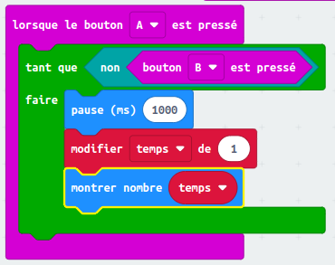

## Démarrer et arrêter ton chronomètre

Utilisons le bouton A pour démarrer ton chronomètre, et le bouton B pour l'arrêter.

+ Ton chronomètre devrait démarrer lorsque le bouton A est pressé. Ajoute un nouveau bloc `lorsque le bouton A pressé` à ton script :
    
    

+ Le chronomètre doit compter aussi longtemps que le bouton B **n'a pas été pressé**. Pour faire cela, glisse un bloc `tant que` dans ton nouvel événement `lorsque le bouton A est pressé` .
    
    

+ Fais glisser un bloc `non` , de « Logique » à ton bloc `tant que` :
    
    

+ Tu peux ensuite faire glisser un bloc `bouton B est pressé` après le bloc `non`.
    
    
    
    Tout code à l'intérieur de cette boucle `tant que` sera répété, **aussi longtemps que le bouton B n'a pas été pressé**.

+ Ensuite, tu veux ajouter 1 à ta variable `temps` à chaque seconde (1 seconde = 1000 ms). Ajoute un bloc `pause` pour que ton chronomètre attende 1 seconde.
    
    

+ Pour augmenter ta variable `temps`
    
    

+ Enfin, tu devras afficher la variable `temps` mise à jour. Voici à quoi ton code devrait ressembler :
    
    

+ Clique « lancer » pour tester ton code.
    
    + Appuie sur les boutons A et B ensemble pour régler ton chronomètre à 0
    + Appuie sur le bouton A pour démarrer ton chronomètre
    + Appuie (et maintiens) sur le bouton B pour arrêter ton chronomètre
    
    

## Défie tes amis !

Utilise le chronomètre pour défier tes amis. Par exemple, tu pourrais voir combien de temps il leur faut pour réciter l'alphabet en arrière, ou nommer 10 capitales.