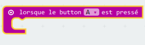

## Démarrer et arrêter ton chronomètre

Utilisons le bouton A pour démarrer ton chronomètre, et le bouton B pour l'arrêter.

+ Ton chronomètre doit démarrer quand le bouton A est appuyé. Ajoute un nouveau bloc `lorsque le bouton A est pressé` à ton script&nbsp;:

	

+ Le chronomètre doit compter tant que le bouton B __n'a pas été pressé__. Pour cela, place tout d'abord un bloc `lorsque` dans ton nouveau bloc `lorsque le bouton A est pressé`.

	

+ Place un bloc `pas`, de 'Logique' dans ton bloc `lorsque`&nbsp;:

	

+ Tu peux alors placer un bloc `bouton B pressé` après le bloc `pas`.

	

	N'importe quel code à l'intérieur de cette boucle `lorsque` sera exécuté indéfiniment, __tant que le bouton B n'est pas pressé__.

+ Ensuite, tu vas devoir ajouter 1 à ta variable `temps` à chaque seconde (1 seconde = 1000 ms). Ajoute un bloc `pause` pour forcer ton chronomètre à attendre 1 seconde.

	

+ Pour augmenter ton variable `temps`,

	

+ Enfin, tu auras besoin d'afficher la variable `temps` mise à jour. Voici ce à quoi ton code devrait ressembler&nbsp;:

	

+ Clique sur 'lancer' pour tester ton code.

	+ Appuie sur les boutons A et B simultannément pour remettre ton chronomètre à 0
	+ Appuie sur le bouton A pour démarrer ton chronomètre
	+ Appuie (et garde appuyé) le bouton B pour arrêter ton chronomètre

	

## Défie tes amis&nbsp;!
Utilise le chronomètre pour défier tes amis. Par exemple, tu pourras voir le temps nécessaire pour qu'ils récitent l'alphabet à l'envers, ou pour qu'ils donnent le nom de 10 capitales.
