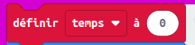
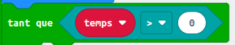

--- challenge ---
## Défi : Compte à Rebours
Peux tu créer un __nouveau__ chronomètre, qui compte à rebours jusqu'à 0 ? Voilà comment ton nouveau chronomètre devrait fonctionner&nbsp;:

+ Appuyer sur A et B simultanément doit donner la valeur 10 à ton `temps`

	

+ Appuyer sur le bouton B doit ajouter 1 à ton chronomètre

	

+ Appuyer sur le bouton A doit enlever 1 de ta variable `temps` jusqu'à atteindre 0. Cela signifie que tu auras besoin d'une boucle `lorsque` qui tourne aussi longtemps que `temps` est plus grand que (`>`) 0.

	

## Chronomètre de précision 
As tu remarqué que ton chronomètre n'est pas très précis ? Cela est du au temps nécessaire pour afficher et faire défiler des nombres sur la micro:bit.

Essaye d'ajuster la pause pour améliorer le chronométrage. Tu peux utiliser un bloc `si/alors` pour avoir une pause plus courte pour les nombres plus grands qui prennent plus de temps à faire défiler.

--- /challenge ---