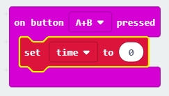

## अपना टाइमर सेट अप करना

आइए बटन A और B को एक साथ दबाए जाने पर आपके टाइमर को 0 पर सेट करें।

+ Go to <a href="http://rpf.io/microbit-new" target="_blank">rpf.io/microbit-new</a> to start a new project in the MakeCode (PXT) editor. अपने प्रोजेक्ट को 'टाइमर' नाम दें।

+ `on start` (शुरू करने पर) और `forever` (हमेशा के लिए) ब्लॉक को हटाएँ >, क्योंकि आपको उनकी आवश्यकता नहीं है।

+ एक नया `on button pressed event` (बटन दबाए जाने पर इवेंट) जोड़ें और `A+B` का चयन करें।
    
    

+ 'Variables' (वेरिएबल) पर क्लिक करके 'Make a variable' (एक वेरिएबल बनाएँ) पर क्लिक करें, और `time` (समय) नामक एक नया वेरिएबल बनाएँ।
    
    

+ जब A और B बटन एक साथ दबाए जाते हैं, आप चाहते हैं कि `time` (समय) को `0` पर सेट किया जाए। ऐसा करने के लिए, `set` (सेट करें) ब्लॉक को अपने `on button A+B pressed` (बटन A+B दबाए जाने पर) ब्लॉक में ड्रैग करें:
    
    

आपको बस शून्य का डिफ़ॉल्ट मान ही चाहिए।

+ आपको `time` (समय) भी प्रदर्शित करना चाहिए। ऐसा करने के लिए, आप `show number` (संख्या दिखाएँ) ब्लॉक को ड्रैग करके उसमें अपना `time` (समय) वेरिएबल ड्रैग करें:
    
    

+ अपने कोड का परीक्षण करने के लिए 'run' (चलाएँ) पर क्लिक करें। अपने टाइमर को 0 पर सेट करने के लिए (micro:bit के नीचे) 'A+B' बटन को दबाएँ।
    
    