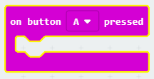
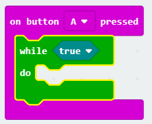
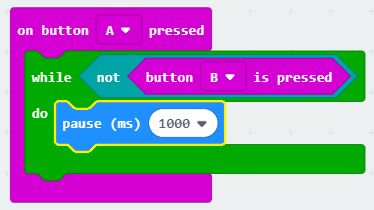
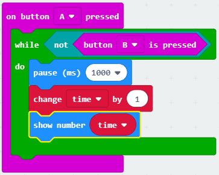

## अपने टाइमर को शुरू करना और रोकना

आइए हम आपके टाइमर को शुरू करने के लिए बटन A का उपयोग करें, और इसे रोकने के लिए बटन B का उपयोग करें।

+ बटन A को दबाने पर आपका टाइमर शुरू होना चाहिए। अपनी स्क्रिप्ट में `on button A pressed` नामक एक नया ब्लॉक जोड़ें:
    
    

+ जब तक बटन B को **दबाया नहीं जाता है ** तब तक टाइमर को गिनना जारी रखना चाहिए। ऐसा करने के लिए, पहले अपने नए `on button A pressed` (बटन A दबाए जाने पर) इवेंट में `while` (जबकि) ब्लॉक को ड्रैग करें।
    
    

+ अपने `while` (जबकि) ब्लॉक में 'Logic' ('तर्क') से एक `not` (नहीं) ब्लॉक को ड्रैग करें:
    
    

+ फिर आप `not` (नहीं) ब्लॉक के बाद एक `button B pressed` (बटन B दबाए जाने पर) ब्लॉक को ड्रैग कर सकते हैं।
    
    
    
    इस `while` (जबकि) लूप के अंदर कोई भी कोड बार-बार चलाया जाएगा, **जब तक बटन B नहीं दबाया जाता है**।

+ इसके बाद, आप अपने `time` (समय) वेरिएबल में हर सेकंड (1 सेकंड = 1000 एमएस) में 1 जोड़ना चाहते हैं। अपने टाइमर को 1 सेकंड के लिए प्रतीक्षा करने के लिए एक `pause` (विराम) ब्लॉक जोड़ें।
    
    

+ अपने `time` (समय) वेरिएबल को बढ़ाने के लिए,
    
    

+ अंत में, आपको अद्यतन `time` (समय) वेरिएबल प्रदर्शित करना होगा। यहाँ दिखाया गया है कि आपका कोड कैसा दिखेगा:
    
    

+ अपने कोड का परीक्षण करने के लिए 'run' (चलाएँ) पर क्लिक करें।
    
    + अपने टाइमर को 0 पर सेट करने के लिए बटन A और B को एक साथ दबाएँ
    + अपना टाइमर शुरू करने के लिए बटन A दबाएँ
    + अपने टाइमर को रोकने के लिए बटन B को दबाएँ (और रोककर रखें)
    
    

## अपने दोस्तों को चुनौती दें!

अपने दोस्तों को चुनौती देने के लिए टाइमर का उपयोग करें। उदाहरण के लिए, आप देख सकते हैं कि उन्हें वर्णमाला को उलटे क्रम में बोलने, या 10 राजधानी शहरों का नाम बताने में कितना समय लगता है।