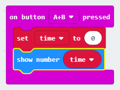

## Postavljanje vremena

Postavimo vaš tajmer na 0 kada se gumbi A i B pritisnu zajedno.

+ Idite na <a href="http://rpf.io/microbit-new" target="_blank">rpf.io/microbit-new</a> da biste pokrenuli novi projekt u MakeCode (PXT) uređivaču. Nazovite svoj projekt 'Timer'.

+ Izbrišite `na početku` i `zauvijek` bloka jer vam ih ne trebaju.

+ Dodajte novu `na gumb pritisnut slučaju` i odaberite `A + B`.
    
    

+ Kliknite "Varijable", a zatim "Napravite varijablu" i stvorite novu varijablu koja se zove `puta`.
    
    

+ Kad se gumbi A i B pritisnu zajedno, želite da se `puta` postavi na `0`. Da biste to učinili, povucite `set` blok u svoj `na gumb A + B pritisne` bloka:
    
    

Zadana vrijednost nula ono je što vam treba.

+ Trebali biste prikazati i `puta`. Da biste to učinili, povucite blok `emisije broj` i uvucite svoju varijablu `puta` u nju:
    
    

+ Kliknite "Pokreni" da biste testirali svoj kôd. Pritisnite gumb "A + B" (ispod mikro: bit) da biste tajmer postavili na 0.
    
    