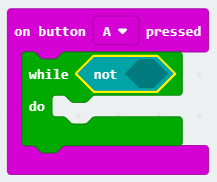
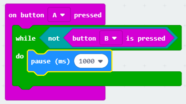

## Pokretanje i zaustavljanje timera

Upotrijebimo gumb A za pokretanje vremena, a gumb B za zaustavljanje.

+ Mjerač vremena trebao bi se pokrenuti kad se pritisne gumb A. Dodajte novi `na gumb Stisnuti` blok u vašu skriptu:
    
    

+ Mjerač vremena trebao bi brojati sve dok tipka B **nije pritisnuta**. Da biste to učinili, prvo povucite blok `dok` u svoj novi gumb `na gumb A pritisnut` događaj.
    
    

+ Povucite blok `ne` , iz "Logike" u svoj `dok` blok:
    
    

+ Zatim možete povući tipku `pritisnutu na` blok nakon bloka `ne`.
    
    
    
    Bilo koji kôd unutar ove `dok će se` petlja pokrenuti više puta, **sve dok gumb B nije pritisnut**.

+ Zatim želite dodati 1 svojoj varijabli `time` svake sekunde (1 sekunda = 1000 ms). Dodavanje `pauza` blok kako bi vaš timer čekati na 1 sekundu.
    
    

+ Da biste povećali svoju varijablu `puta`,
    
    

+ Napokon, morat ćete prikazati ažuriranu varijablu `puta`. Ovako bi tvoj kôd trebao izgledati:
    
    

+ Kliknite "Pokreni" da biste testirali svoj kôd.
    
    + Pritisnite gumbe A i B zajedno da postavite tajmer na 0
    + Pritisnite gumb A da biste pokrenuli tajmer
    + Pritisnite (i držite) tipku B da biste zaustavili tajmer
    
    

## Izazovite svoje prijatelje!

Upotrijebite tajmer da izazovete svoje prijatelje. Na primjer, mogli ste vidjeti koliko im treba da izgovore abecedu unatrag ili imenuju 10 glavnih gradova.