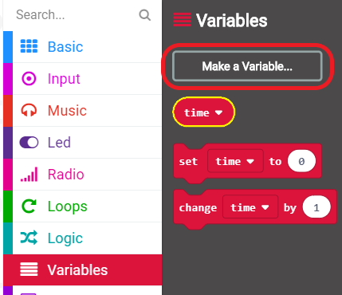

## ನಿಮ್ಮ ಟೈಂರನ್ನು ಹೊಂದಿಸುವುದು

A ಮತ್ತು B ಗುಂಡಿಗಳನ್ನು ಒತ್ತಿದಾಗ ನಿಮ್ಮ ಟೈಮರ್ 0 ಗೆ ಹೊಂದಿಸೋಣ.

+ MakeCode (PXT) ಸಂಪಾದಕದಲ್ಲಿ ಹೊಸ ಯೋಜನೆಯನ್ನು ಪ್ರಾರಂಭಿಸಲು <a href="http://rpf.io/microbit-new" target="_blank">rpf.io/microbit-new</a>ಗೆ ಹೋಗಿ. ನಿಮ್ಮ ಯೋಜನೆಯನ್ನ 'ಟೈಮರ್' ಎಂದು ಹೆಸರಿಸಿ.

+ `on start` ಮತ್ತು `forever` blocks ತೇಗಿಯಿರಿ, ಅದು ನಿಮಗೆ ಅಗತ್ಯವಿಲ್ಲ.

+ ಹೊಸ `on button pressed event` ಅನ್ನು ಸೇರಿಸಿ, ಮತ್ತು `A+B`ಅನ್ನು ಆಯ್ಕೆ ಮಾಡಿ:.
    
    

+ 'Variables' ಕ್ಲಿಕ್ ಮಾಡಿ ನಂತರ 'Make a variable' ಕ್ಲಿಕ್ ಮಾಡಿ ಮತ್ತು `time` ಅಂತ ಹೊಸ variable ಮಾಡಿ.
    
    

+ ಎ ಮತ್ತು ಬಿ ಗುಂಡಿಗಳನ್ನು ಒಟ್ಟಿಗೆ ಒತ್ತಿದಾಗ, ನಿಮ್ಮ `time` ಅನ್ನು `0` ಗೆ ಹೊಂದಿಸಬೇಕು. ಇದನ್ನು ಮಾಡಲು `set` ಬ್ಲಾಕನ್ನು ನಿಮ್ಮ `on button A+B pressed` ಬ್ಲಾಕಿನಲ್ಲಿ ಎಲಿಯಿರಿ:
    
    

ನಿಮಗೆ ಶೂನ್ಯದ ಪೂರ್ವನಿಯೋಜಿತ ಮೌಲ್ಯವು ಬೇಕು.

+ ನೀವು `time` ಸಹ ಪ್ರದರ್ಶಿಸಬೇಕು. ಇದನ್ನು ಮಾಡಲು `show number` ಬ್ಲಾಕನ್ನು ಎಲಿಯಿರಿ ಮತ್ತೆ `time` ವೇರಿಯೇಬಲ್ ಅನ್ನು ಅದರಲ್ಲಿ ಎಲಿಯಿರಿ:
    
    

+ ನಿಮ್ಮ ಯೋಜನೆಯನ್ನು ಪರೀಕ್ಷಿಸಲು 'run' ಕ್ಲಿಕ್ ಮಾಡಿ. ಟೈಮರ್ ಅನ್ನು ಶೂನ್ಯಕ್ಕೆ ಹೊಂದಿಸಲು ನಿಮ್ಮ(micro:bit) ಕೆಳಗೆ ಇರುವ 'A+B' ಬಟನ್ ಒತ್ತಿ.
    
    