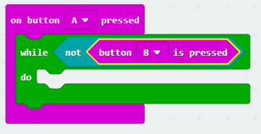

## ನಿಮ್ಮ ಟೈಮರನ್ನು ಪ್ರಾರಂಭಿಸುವುದು ಮತ್ತು ನಿಲ್ಲಿಸುವುದು

ನಿಮ್ಮ ಟೈಮರ್ ಅನ್ನು ಪ್ರಾರಂಭಿಸಲು ಬಟನ್ A ಮತ್ತು ಅದನ್ನು ನಿಲ್ಲಿಸಲು ಬಟನ್ B ಅನ್ನು ಬಳಸೋಣ.

+ Button A ಒತ್ತಿದಾಗ ನಿಮ್ಮ ಟೈಮರ್ ಪ್ರಾರಂಭವಾಗಬೇಕು. ಹೊಸ `on button A pressed` block ಅನ್ನು ನಿಮ್ಮ ಯೋಜನೆಗೆ ಸೇರಿಸಿ:
    
    

+ ಬಟನ್ B ** ಅನ್ನು ಒತ್ತುವವರೆಗೂ ಟೈಮರ್ ಎಣಿಸಬೇಕು **. ಇದನ್ನು ಮಾಡಲು `while` ಬ್ಲಾಕನ್ನು ನಿಮ್ಮ `on button A pressed` ಬ್ಲಾಕಿನಲ್ಲಿ ಎಲಿಯಿರಿ.
    
    

+ 'Logic ' ಇಂದ ಒಂದು `not` ಬ್ಲಾಕ್ ಅನ್ನು ನಿಮ್ಮ `while` block ಒಳಗೆ ಇಳಿಯಿರಿ:
    
    

+ ನಂತರ ನೀವು ಒಂದು `button B pressed` ಬ್ಲಾಕ್ ಅನ್ನು `not` ಬ್ಲಾಕ್ ಆದಮೇಲೆ ಇಳಿಯಿರಿ.
    
    
    
    `while` ಲೂಪ್ ಒಳಗಿರುವ ಕೋಡ್ ಪದೇ ಪದೇ ಚಲಾಯಿಸಲಾಗುತ್ತದೆ,** ಎಲ್ಲಿಯವರೆಗೂ button B ಅನ್ನು ನೀವು ಒತ್ತಲ್ಲ**.

+ ಮುಂದೆ, ನಿಮ್ಮ `time` ವೇರಿಯೇಬಲ್ ಇಗೆ ಪ್ರತಿ ಸೆಕೆಂಡ್ ಒಂದಿರಿಂದ ಜೋಡಿಸಬೇಕು (1 ಸೆಕೆಂಡ್ = 1000 ms). ನಿಮ್ಮ ಟೈಮರ್ ಅನ್ನು 1 ಸೆಕೆಂಡಿಗೆ ವಿರಾಮಿಸಲು ನಿಮ್ಮ ಯೋಜನೆಗೆ `pause` block ಅನ್ನು ಸೇರಿಸಿ.
    
    

+ ನಿಮ್ಮ `time` ವೇರಿಯಬಲ್ ಹೆಚ್ಚಿಸಲು,
    
    

+ ಅಂತಿಮವಾಗಿ, ನೀವು ನವೀಕರಿಸಿದ ` time ` ವೇರಿಯಬಲ್ ಪ್ರದರ್ಶಿಸಬೇಕಾಗುತ್ತದೆ. ನಿಮ್ಮ ಕೋಡ್ ಹೇಗೆ ಕಾಣಬೇಕು:
    
    

+ ನಿಮ್ಮ ಯೋಜನೆಯನ್ನು ಪರೀಕ್ಷಿಸಲು 'run' ಕ್ಲಿಕ್ ಮಾಡಿ.
    
    + ನಿಮ್ಮ ಟೈಮರ್ ಇಗೆ 0 ಗೆ ಹೊಂದಿಸಲು A ಮತ್ತು B buttons ಒಟ್ಟಿಗೆ ಒತ್ತಿರಿ
    + ನಿಮ್ಮ ಟೈಮರ್ ಪ್ರಾರಂಭಿಸಲು ಬಟನ್ A ಒತ್ತಿರಿ
    + ನಿಮ್ಮ ಟೈಮರ್ ಅನ್ನು ನಿಲ್ಲಿಸಲು button B ಒತ್ತಿ (ಮತ್ತು ಹಿಡಿದುಕೊಳ್ಳಿ)
    
    

## ನಿಮ್ಮ ಸ್ನೇಹಿತರಿಗೆ ಚಾಲೆಂಜ್ ಮಾಡಿ!

ಟೈಮರ್ ಅನ್ನು ಉಪಯೋಗಿಸಿ ನಿಮ್ಮ ಸ್ನೇಹಿತರಿಗೆ ಚಾಲೆಂಜ್ ಮಾಡಿ. ಉದಾಹರಣೆಗೆ, ವರ್ಣಮಾಲೆಯನ್ನು ಹಿಂದಕ್ಕೆ ಹೇಳಲು ಎಷ್ಟು ಸಮಯ ತೆಗೆದುಕೊಳ್ಳುತ್ತದೆ ಎಂಬುದನ್ನು ನೀವು ನೋಡಬಹುದು, ಅಥವಾ 10 ರಾಜಧಾನಿ ನಗರಗಳನ್ನು ಹೆಸರಿಸಿ.