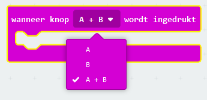
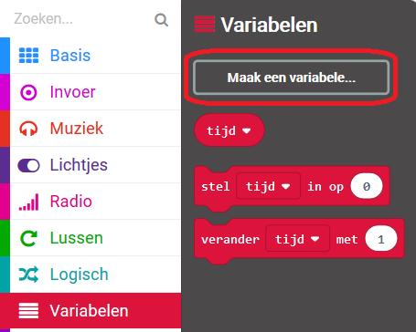
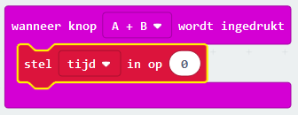
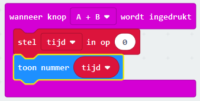

## Je timer instellen

We gaan je timer instellen op 0 wanneer knoppen A en B samen worden ingedrukt.

+ Ga naar <a href="http://rpf.io/microbit-new" target="_blank">rpf.io/microbit-new</a> om een ​​nieuw project te starten in de MakeCode (PXT) editor. Noem je project 'Timer'.

+ Verwijder de `bij opstarten` en `de hele tijd` blokken, omdat je ze niet nodig hebt.

+ Voeg een nieuwe `wanneer knop wordt ingedrukt` gebeurtenis toe en selecteer `A+B`:.
    
    

+ Klik op de 'Variables' en vervolgens op 'Make a variable' en maak een nieuwe variabele met de naam `tijd`.
    
    

+ Wanneer knoppen A en B samen worden ingedrukt, wil je de `tijd` instellen op `0`. Sleep hiervoor een `stel in op` blok in je `wanneer knop A+B wordt ingedrukt` blok:
    
    

De standaardwaarde nul is wat je nodig hebt.

+ Je moet ook de `tijd` tonen. Om dit te doen, voeg een `toon nummer` blok toe en sleep er je `tijd` variabele in:
    
    

+ Klik op 'run' om je code te testen. Druk op de 'A+B'-knop (onder de micro:bit) om je timer op 0 te zetten.
    
    