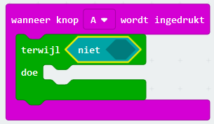

## Je timer starten en stoppen

We gaan knop A gebruiken om je timer te starten en knop B om deze te stoppen.

+ Je timer moet starten wanneer knop A wordt ingedrukt. Voeg een nieuw `wanneer knop A wordt ingedrukt` blok toe aan je code:
    
    

+ De timer moet omhoog tellen zolang knop B **niet is ingedrukt**. Sleep hiervoor eerst een `terwijl` blok in je nieuwe `wanneer knop A wordt ingedrukt` gebeurtenis.
    
    

+ Sleep een `niet` blok, van 'Logisch' naar je `terwijl` blok:
    
    

+ Je kunt vervolgens een `wanneer knop B wordt ingedrukt` blok na het `niet` blok slepen.
    
    
    
    Alle code binnen deze `terwijl` lus wordt herhaald, **zolang knop B niet is ingedrukt**.

+ Vervolgens wil je elke seconde (1 seconde = 1000 ms) 1 toevoegen aan je `tijd` variabele. Voeg een `pauzeer` blok toe om je timer 1 seconde te laten wachten.
    
    

+ Om je `tijd` variabele te verhogen,
    
    

+ Tenslotte moet je de bijgewerkte `tijd` variabele tonen. Zo zou je code eruit moeten zien:
    
    

+ Klik op 'run' om je code te testen.
    
    + Druk tegelijkertijd op knoppen A en B om je timer op 0 in te stellen
    + Druk op knop A om je timer te starten
    + Druk op knop B (en houd deze ingedrukt) om je timer te stoppen
    
    

## Daag je vrienden uit!

Gebruik de timer om je vrienden uit te dagen. Je kunt bijvoorbeeld zien hoe lang het duurt om het alfabet achterstevoren te zeggen of 10 hoofdsteden te noemen.