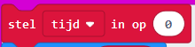
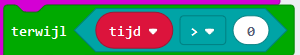

\--- challenge \---

## Uitdaging: aftellen

Kun je een **nieuwe** timer maken, die aftelt tot 0? Dit is hoe je nieuwe timer zou moeten werken:

+ Als je de knoppen A en B tegelijk indrukt, moet je `timer` worden ingesteld op 0
    
    

+ Knop B indrukken moet 1 toevoegen aan je timer. Druk er 10 keer op om een timer van 10 seconden te maken.
    
    

+ Het indrukken van knop A moet 1 aftrekken van je `tijd` variabele tot die 0 wordt. Dit betekent dat je een `terwijl` lus nodig hebt die loopt zo lang de `tijd` groter is dan (`>`) 0.
    
    

## Nauwkeurige timer

Heb je gemerkt dat de timer niet erg nauwkeurig is! Dit is omdat het tijd kost om getallen op de micro:bit te tonen en te scrollen.

Probeer de pauze aan te passen om de timing te verbeteren. Je kunt een `als/dan` blok gebruiken om kortere vertragingen te krijgen voor grotere getallen die langer nodig hebben om te scrollen.

\--- /challenge \---