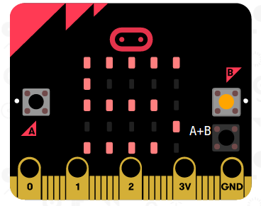

## Starting and stopping your timer

Let's use button A to start your timer, and button B to stop it.

+ Your timer should start when button A is pressed. Add a new `on button A pressed` block to your script:
    
    

+ The timer should count up as long as button B **has not been pressed**. To do this, first drag a `while` block into your new `on button A pressed` event.
    
    

+ Drag a `not` block, from 'Logic' to your `while` block:
    
    

+ You can then drag a `button B pressed` block after the `not` block.
    
    
    
    Any code inside this `while` loop will be run repeatedly, **as long as button B has not been pressed**.

+ Next, you want to add 1 to your `time` variable every second (1 second = 1000 ms). Add a `pause` block to make your timer wait for 1 second.
    
    

+ To increase your `time` variable,
    
    

+ Finally, you'll need to display the updated `time` variable. Here's how your code should look:
    
    

+ Click 'run' to test your code.
    
    + Press buttons A and B together to set your timer to 0
    + Press button A to start your timer
    + Press (and hold) button B to stop your timer
    
    

## Challenge your friends!

Use the timer to challenge your friends. For example, you could see how long it takes them to say the alphabet backwards, or name 10 capital cities.